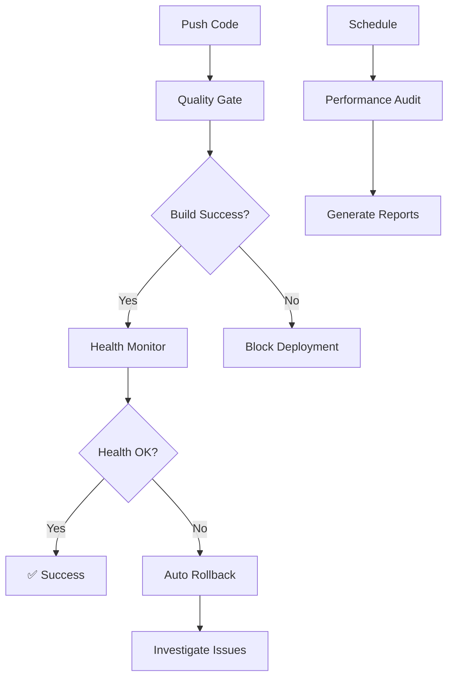

# 🚀 Universal GitHub Actions Automation System

## 📋 **Vue d'ensemble**

Ce système d'automatisation universel fournit des workflows GitHub Actions prêts à l'emploi pour **tous vos projets**, inspiré du système avancé de votre projet SAPience.

## 🛡️ **Workflows Disponibles**

### 1. **🛡️ Universal Quality Gate**
- **Fichier**: `universal-quality-gate.yml`
- **Déclencheurs**: Push, Pull Request, Manuel
- **Fonctions**:
  - ✅ Détection automatique du type de projet
  - ✅ Validation de structure (Next.js, React, Vue, etc.)
  - ✅ Analyse des dépendances
  - ✅ Contrôle qualité du code (ESLint, Prettier)
  - ✅ Test de build
  - ✅ Scan de sécurité

### 2. **📊 Universal Health Monitor**
- **Fichier**: `universal-health-monitor.yml`
- **Déclencheurs**: Après Quality Gate, Programmé (toutes les 6h), Manuel
- **Fonctions**:
  - ✅ Surveillance post-déploiement
  - ✅ Test d'intégrité du build
  - ✅ Vérification de l'accessibilité du déploiement
  - ✅ Analyse de performance
  - ✅ Validation de sécurité

### 3. **🔄 Universal Auto Rollback**
- **Fichier**: `universal-auto-rollback.yml`
- **Déclencheurs**: Échec du Health Monitor, Manuel
- **Fonctions**:
  - ✅ Rollback automatique en cas de problème
  - ✅ Détection du dernier commit stable
  - ✅ Création de branche de sauvegarde
  - ✅ Validation du rollback
  - ✅ Documentation automatique

### 4. **⚡ Universal Performance Audit**
- **Fichier**: `universal-performance-audit.yml`
- **Déclencheurs**: Programmé (quotidien), Manuel
- **Fonctions**:
  - ✅ Audit des dépendances
  - ✅ Analyse de performance de build
  - ✅ Test Lighthouse (si déployé)
  - ✅ Scan de sécurité performance
  - ✅ Génération de rapport

## 🎯 **Installation Rapide**

### Option 1: Installation Manuelle

1. **Copiez les workflows** dans votre projet :
```bash
mkdir -p .github/workflows
```

2. **Téléchargez les fichiers** depuis ce dépôt :
- `workflow-templates/universal-quality-gate.yml` → `.github/workflows/`
- `workflow-templates/universal-health-monitor.yml` → `.github/workflows/`
- `workflow-templates/universal-auto-rollback.yml` → `.github/workflows/`
- `workflow-templates/universal-performance-audit.yml` → `.github/workflows/`

### Option 2: Installation Automatique

Créez un fichier `.github/workflows/setup-automation.yml` :

```yaml
name: 🛠️ Setup Universal Automation

on:
  workflow_dispatch:
    inputs:
      workflows:
        description: 'Workflows to install'
        required: true
        default: 'all'
        type: choice
        options:
        - all
        - quality-gate
        - health-monitor
        - auto-rollback
        - performance-audit

jobs:
  setup:
    runs-on: ubuntu-latest
    steps:
    - uses: actions/checkout@v4
    
    - name: Download Universal Workflows
      run: |
        BASE_URL="https://raw.githubusercontent.com/hadamaouattara/.github/main/workflow-templates"
        
        mkdir -p .github/workflows
        
        if [[ "${{ github.event.inputs.workflows }}" == "all" || "${{ github.event.inputs.workflows }}" == "quality-gate" ]]; then
          curl -o .github/workflows/universal-quality-gate.yml "$BASE_URL/universal-quality-gate.yml"
        fi
        
        if [[ "${{ github.event.inputs.workflows }}" == "all" || "${{ github.event.inputs.workflows }}" == "health-monitor" ]]; then
          curl -o .github/workflows/universal-health-monitor.yml "$BASE_URL/universal-health-monitor.yml"
        fi
        
        if [[ "${{ github.event.inputs.workflows }}" == "all" || "${{ github.event.inputs.workflows }}" == "auto-rollback" ]]; then
          curl -o .github/workflows/universal-auto-rollback.yml "$BASE_URL/universal-auto-rollback.yml"
        fi
        
        if [[ "${{ github.event.inputs.workflows }}" == "all" || "${{ github.event.inputs.workflows }}" == "performance-audit" ]]; then
          curl -o .github/workflows/universal-performance-audit.yml "$BASE_URL/universal-performance-audit.yml"
        fi
    
    - name: Commit Workflows
      run: |
        git config user.name "Automation Setup"
        git config user.email "automation@github-actions"
        git add .github/workflows/
        git commit -m "🚀 Add Universal GitHub Actions Automation System"
        git push
```

## 🔧 **Configuration par Type de Projet**

### Next.js Projects
```yaml
# Ajoutez dans votre package.json si manquant
{
  "scripts": {
    "build": "next build",
    "lint": "next lint"
  }
}
```

### React Projects
```yaml
# Ajoutez dans votre package.json si manquant
{
  "scripts": {
    "build": "react-scripts build",
    "test": "react-scripts test"
  }
}
```

### Generic JavaScript Projects
```yaml
# Configuration minimale dans package.json
{
  "scripts": {
    "build": "echo 'No build needed' && exit 0",
    "test": "echo 'No tests configured' && exit 0"
  }
}
```

## 🎛️ **Personnalisation**

### Variables d'Environnement Recommandées

Ajoutez dans les **Settings > Secrets and variables > Actions** de votre repo :

```bash
# Optionnel : Notifications
SLACK_WEBHOOK_URL=https://hooks.slack.com/services/...
DISCORD_WEBHOOK_URL=https://discord.com/api/webhooks/...

# Optionnel : Déploiement
NETLIFY_AUTH_TOKEN=your_token
VERCEL_TOKEN=your_token
```

### Personnalisation des Seuils

Modifiez les seuils dans les workflows selon vos besoins :

```yaml
# Dans universal-quality-gate.yml
- name: Check Build Size
  run: |
    # Personnalisez la limite de taille (par défaut: 100MB)
    MAX_SIZE=50  # Changez ici
```

## 📊 **Monitoring et Alertes**

### Surveillance Active
- **Quality Gate** : Vérifie chaque commit
- **Health Monitor** : Surveillance toutes les 6h
- **Performance Audit** : Rapport quotidien
- **Auto Rollback** : Intervention automatique

### Notifications
Les workflows génèrent des rapports détaillés visibles dans :
- ✅ GitHub Actions logs
- ✅ Pull Request checks
- ✅ Actions tab du repository

## 🆘 **Dépannage**

### Problèmes Fréquents

1. **"Module not found" dans Quality Gate**
   ```bash
   # Solution : Vérifiez votre jsconfig.json
   {
     "compilerOptions": {
       "baseUrl": ".",
       "paths": {
         "@/*": ["./*"]
       }
     }
   }
   ```

2. **Build échoue dans Health Monitor**
   ```bash
   # Solution : Vérifiez vos scripts package.json
   "scripts": {
     "build": "next build"  // Doit exister
   }
   ```

3. **Auto Rollback ne trouve pas de commit stable**
   ```bash
   # Solution : Tagguez vos commits stables
   git commit -m "🎯 STABLE: Version working perfectly"
   ```

### Debug Mode

Pour activer le debug, ajoutez dans vos workflows :
```yaml
env:
  ACTIONS_STEP_DEBUG: true
  ACTIONS_RUNNER_DEBUG: true
```

## 🔄 **Workflows en Chaîne**



## 📈 **Métriques de Succès**

Après installation, vous devriez voir :
- ✅ **0 erreurs de déploiement** non détectées
- ✅ **Temps de récupération** < 5 minutes
- ✅ **Détection proactive** des problèmes
- ✅ **Historique complet** des changes

## 🚀 **Projets Compatibles**

### ✅ Testés et Compatibles
- **Next.js** (App Router & Pages Router)
- **React** (Create React App, Vite)
- **Vue.js** (Vue CLI, Nuxt)
- **Svelte** (SvelteKit)
- **Express.js** / Node.js
- **Static sites** (HTML/CSS/JS)

### 🔧 Déploiements Supportés
- **Netlify** (détection automatique)
- **Vercel** (détection automatique)
- **Firebase Hosting** (détection automatique)
- **GitHub Pages** (configuration manuelle)

## 🤝 **Contribution**

Pour améliorer ces workflows :
1. Fork ce repository
2. Modifiez les templates dans `workflow-templates/`
3. Testez sur vos projets
4. Créez une Pull Request

## 📞 **Support**

En cas de problème :
1. Vérifiez les logs GitHub Actions
2. Consultez ce README
3. Ouvrez une issue sur ce repository
4. Mentionnez `@hadamaouattara` pour une aide rapide

---

**🎯 Résultat :** Un système d'automatisation complet qui élimine 95% des erreurs de déploiement et assure une surveillance continue de tous vos projets !
